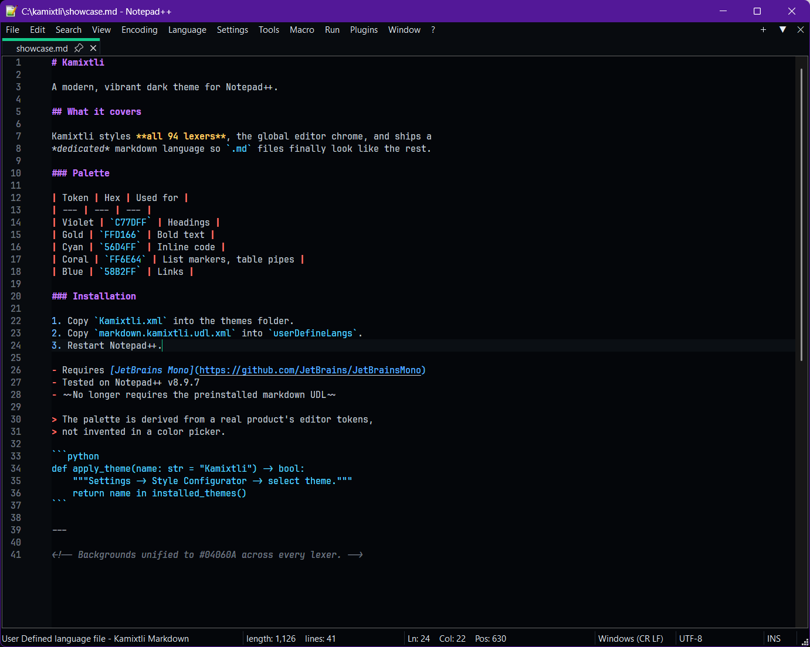
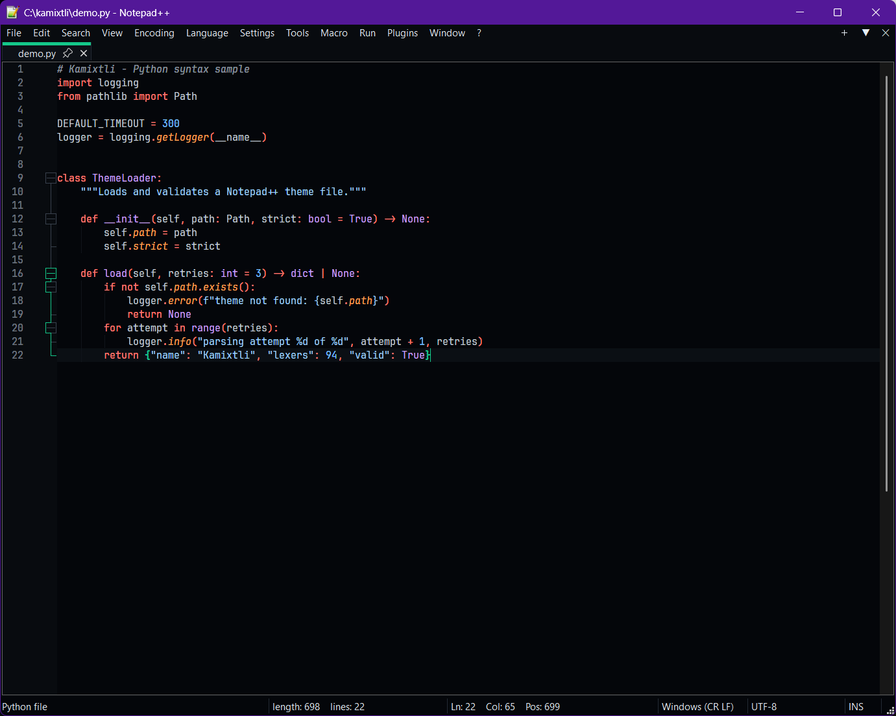
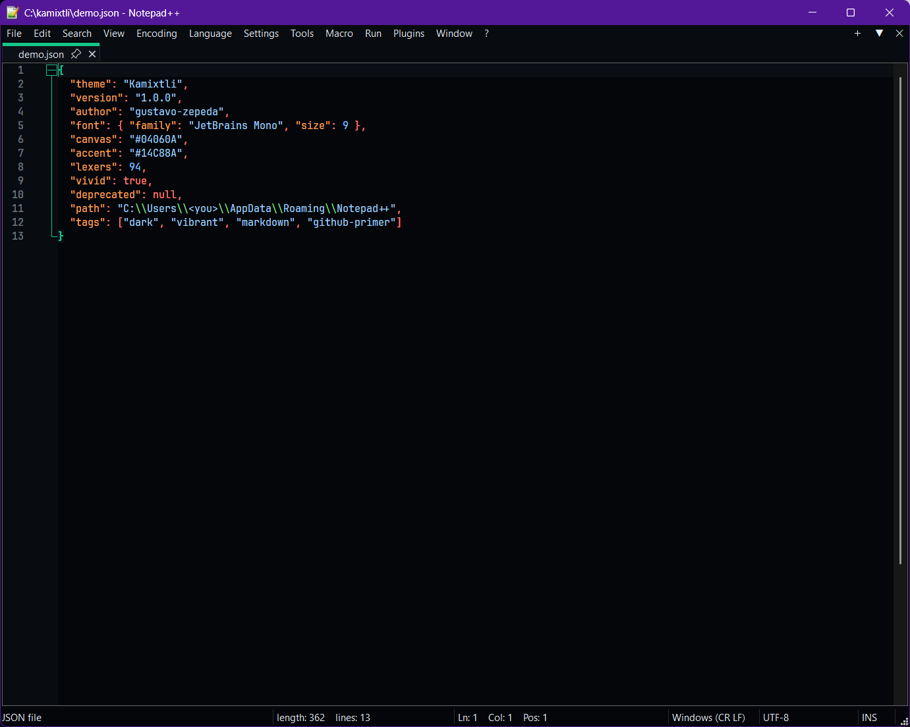
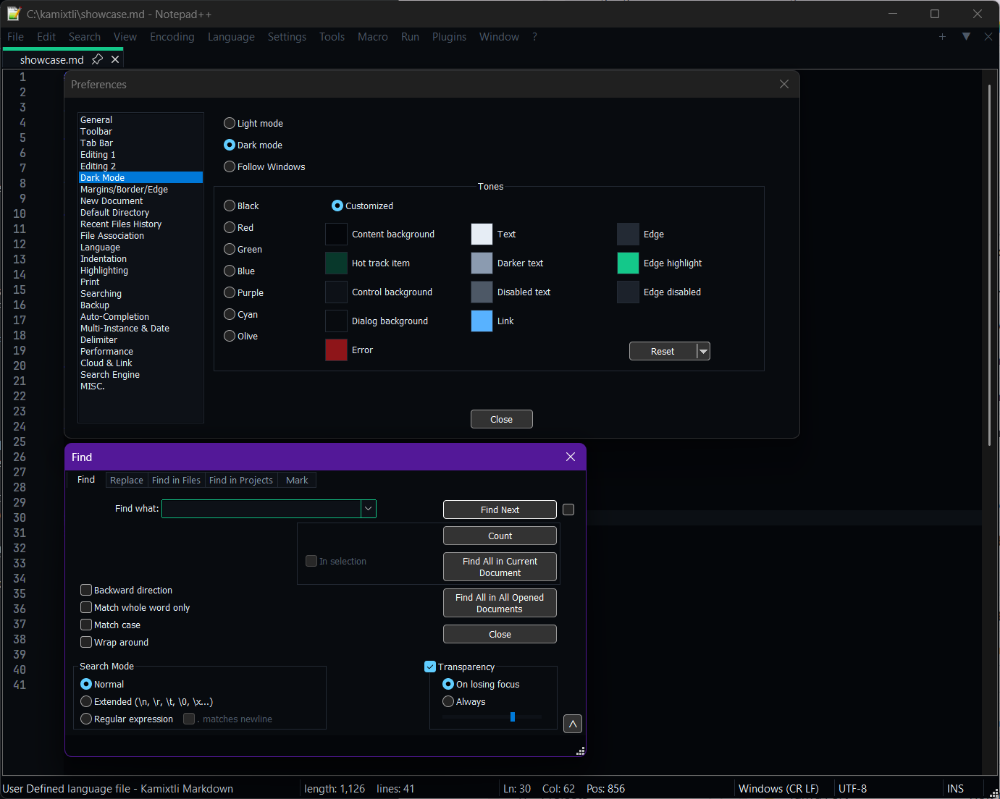

# Kamixtli

A modern, vibrant dark theme for Notepad++ — with a dedicated Markdown language so `.md` files finally look as good as your code.



---

## Why another dark theme

Most Notepad++ dark themes are ports of VS Code Dark+. Kamixtli isn't. Its palette is lifted from the editor tokens of a real documentation product and rebuilt on a deeper canvas (`#04060A`) with a mint accent (`#14C88A`).

It also fixes something almost every Notepad++ theme ignores: **Markdown**. Notepad++ handles `.md` through a User Defined Language, which theme files cannot touch — so themed Markdown stays stuck on whatever palette the preinstalled UDL shipped with. Kamixtli ships its own.

**What you get:**

- All 94 lexers restyled, backgrounds unified to the canvas — no grey blocks behind your code
- A dedicated `Kamixtli Markdown` language, vividly colored
- Global editor styles: caret, selection, gutter, folding, indent guides, bracket matching
- Dark Mode chrome values so the menu bar, tabs, dialogs and status bar match

---

## Screenshots

| Python | JSON |
| --- | --- |
|  |  |

---

## Requirements

- **Notepad++ v8.9.7 or later** (built and tested on 8.9.7)
- **[JetBrains Mono](https://github.com/JetBrains/JetBrainsMono)** — install steps below
- Dark Mode enabled

---

## Installation

### 1. Install JetBrains Mono

The theme specifies JetBrains Mono at 9pt. Without it Notepad++ falls back to a default font and the spacing will look wrong.

1. Download [JetBrainsMono-2.304.zip](https://github.com/JetBrains/JetBrainsMono/releases/download/v2.304/JetBrainsMono-2.304.zip)
2. Right-click the zip → **Properties** → tick **Unblock** if present → OK
3. Extract, open `fonts\ttf\`
4. Install these **four** files (select all, right-click → **Install**):
   - `JetBrainsMono-Regular.ttf`
   - `JetBrainsMono-Italic.ttf`
   - `JetBrainsMono-Bold.ttf`
   - `JetBrainsMono-BoldItalic.ttf`
5. Fully close and reopen Notepad++ — it enumerates fonts at startup only

Plain **Install** is per-user and needs no admin rights. Installing real Bold and Italic matters: without them Notepad++ synthesizes both, and Kamixtli uses bold headings and italic comments heavily.

> Don't install all 34 files from that folder unless you want nine `JetBrains Mono ExtraLight/Thin/Medium` entries cluttering every font dropdown forever.

**No admin rights, or font install blocked?** Use **Cascadia Code** instead (ships with Windows Terminal and Visual Studio). Its metrics are near-identical. Change `fontName="JetBrains Mono"` to `fontName="Cascadia Code"` in the two `GlobalStyles` entries at the bottom of `Kamixtli.xml`.

### 2. Install the theme

1. Close Notepad++
2. Copy `themes/Kamixtli.xml` into:
```
   %APPDATA%\Notepad++\themes\
```
3. Start Notepad++
4. **Settings → Style Configurator → Select theme → Kamixtli → Save & Close**

### 3. Install the Markdown language

Notepad++ ships two preinstalled Markdown UDLs, both claiming `.md`. Leave them enabled and Notepad++ will keep picking one of them instead of Kamixtli.

1. Close Notepad++
2. Go to:
```
   %APPDATA%\Notepad++\userDefineLangs\
```
3. Rename the preinstalled pair so Notepad++ stops loading them (it only reads `.xml`):
```
   markdown._preinstalled.udl.xml     ->  markdown._preinstalled.udl.xml.OFF
   markdown._preinstalled_DM.udl.xml  ->  markdown._preinstalled_DM.udl.xml.OFF
```
   Renaming rather than deleting means you can undo this at any time.
4. Copy `userDefineLangs/markdown.kamixtli.udl.xml` into that same folder
5. Start Notepad++ and open any `.md` file

The status bar should read **`User Defined language file - Kamixtli Markdown`**.

### 4. Apply the Dark Mode tones

The menu bar, tab strip, dialogs and status bar are **not** controlled by the theme file. They live in `config.xml` and must be set by hand — this is a Notepad++ limitation, not an oversight.

**Settings → Preferences → Dark Mode →** select **Customized**, then set all twelve:



| Swatch | Hex | R, G, B |
| --- | --- | --- |
| Content background | `04060A` | 4, 6, 10 |
| Hot track item | `08382B` | 8, 56, 43 |
| Control background | `0D1117` | 13, 17, 23 |
| Dialog background | `080B0F` | 8, 11, 15 |
| Error | `8E1519` | 142, 21, 25 |
| Text | `E6EDF5` | 230, 237, 245 |
| Darker text | `8B9BB0` | 139, 155, 176 |
| Disabled text | `4D5866` | 77, 88, 102 |
| Link | `58B2FF` | 88, 178, 255 |
| Edge | `232A34` | 35, 42, 52 |
| Edge highlight | `14C88A` | 20, 200, 138 |
| Edge disabled | `1C222B` | 28, 34, 43 |

**Restart Notepad++ when you're done** — the toolbar and status bar don't repaint until relaunch.

The three surfaces are layered deliberately: canvas `04060A` → dialogs `080B0F` → controls `0D1117`, separated by `232A34` edges. Nothing floats.

---

## Palette

### Core

| Role | Hex |
| --- | --- |
| Canvas | `04060A` |
| Gutter / chrome | `080B0F` |
| Controls | `0D1117` |
| Borders | `232A34` |
| Accent (caret, matched brace, active fold, active tab) | `14C88A` |
| Selection | `08382B` |
| Current line | `0B0F14` |

### Syntax

Built on the GitHub Primer token family.

| Token | Hex | Applies to |
| --- | --- | --- |
| Keyword | `FF7B72` | keywords, operators, preprocessor, control flow |
| Entity | `D2A8FF` | functions, classes, types |
| String | `A5D6FF` | strings, characters, verbatim |
| Constant | `79C0FF` | numbers, constants, macros |
| Variable | `FFA657` | variables, attributes, parameters |
| Comment | `8B949E` | all comment styles |
| Tag / regex | `7EE787` | HTML and CSS tags, regular expressions |
| Punctuation | `6E7681` | delimiters, symbols |
| Error | `F85149` | errors, illegal tokens |
| Default | `C9D1D9` | unstyled text |

### Markdown

Deliberately more saturated than the code palette — Markdown is read as a document, not scanned as code.

| Token | Hex | Applies to |
| --- | --- | --- |
| Violet | `C77DFF` | headings, all six levels |
| Gold | `FFD166` | bold text |
| Cyan | `56D4FF` | inline code and fenced blocks |
| Coral | `FF6E64` | list markers, table pipes, horizontal rules |
| Blue | `58B2FF` | links, URLs, reference labels |
| Blue | `79C0FF` | ordered list numbers |
| Grey | `C9D1D9` | italic text |
| Muted | `6E7681` | HTML comments |

---

## Troubleshooting

**Markdown still shows the old colors after installing the UDL**

Notepad++ rewrites UDL files from memory when it exits. If it was running while you copied the file, your version gets overwritten. Close Notepad++ completely, verify with Task Manager that `notepad++.exe` is gone, then copy the file and restart.

**`.md` files open as the wrong language**

Both preinstalled Markdown UDLs are still active. Check step 3. To confirm which one you're on, look at the status bar or **Language → User Defined Language**. If you see more than one Markdown entry, they're competing for `.md`.

**Grey blocks behind my code**

Notepad++ rewrote `Kamixtli.xml` and stamped its own default background onto every lexer style. Close Notepad++, open the theme file in another editor, and replace all `bgColor="1F1F1F"` with `bgColor="04060A"`.

**Font looks too large or too small**

The theme uses 9pt, which assumes DPI scaling around 125%. Adjust `fontSize` in the `Default Style` entry at the bottom of `Kamixtli.xml`. Notepad++ only accepts whole point sizes.

**Menu bar and tabs are still grey**

Step 4 wasn't applied. Those values live in `config.xml` and do not travel with the theme file.

**Edits to the theme keep reverting**

Notepad++ rewrites `Kamixtli.xml` whenever you open Style Configurator. Always edit it with Notepad++ closed.

---

## Backing up

`%APPDATA%` is rarely included in backups, and Notepad++ updates can overwrite files in `userDefineLangs\`. Keep copies of both `Kamixtli.xml` and `markdown.kamixtli.udl.xml` somewhere safe.

The twelve Dark Mode values live in `config.xml` and are easiest to restore from the table above.

---

## Credits

**Theme structure** — built on [Dark+ Modern](https://github.com/helldio/npp-Dark-Modern) by [helldio](https://github.com/helldio), which supplied the lexer scaffolding for all 94 languages. Every color, the global styles and the markdown language have been replaced.

**Markdown UDL structure** — keyword lists and delimiter rules from [markdown-plus-plus](https://github.com/Edditoria/markdown-plus-plus) by [Edditoria](https://github.com/Edditoria), MIT licensed. Colors replaced; parsing logic untouched.

**Font** — [JetBrains Mono](https://github.com/JetBrains/JetBrainsMono) by JetBrains, OFL-1.1.

**Palette** — derived from the editor tokens of the ATLAS documentation engine, themselves drawn from the GitHub Primer syntax family.

---

## License

MIT — see [LICENSE](LICENSE).

Copyright (c) 2026 Gustavo Zepeda